# Allergy Scheduler User Manual

Welcome to Allergy Scheduler! This guide will help you get started and make the most of the app's features to manage your allergy treatment schedule.

## 1. Getting Started

### 1. Authentication
Securely access your data using your **Email & Password** or **Google Sign-In**.

### 2. User Profile
Manage your account details and view your unique User ID.

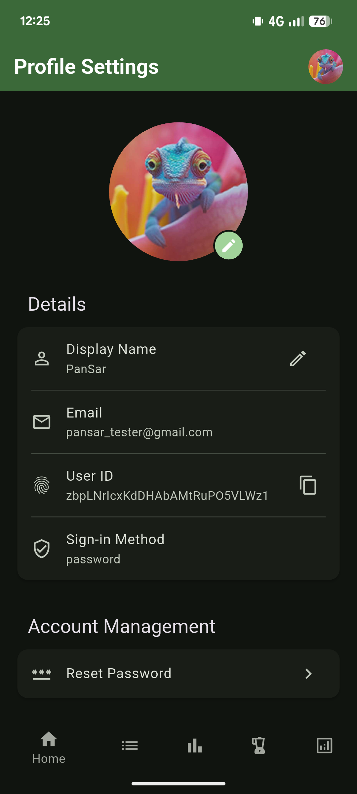

### Logging In

- **Log in:** Once you have an account, you can log in using the same method you used to sign up.

## 2. Subscription Plans

Allergy Scheduler offers three tiers to suit your needs. You can upgrade at any time through the Profile menu.

### 💎 Summary of Subscription Tiers

| Feature                    | Free       | Plus       | Premium      |
| :------------------------- | :--------- | :--------- | :----------- |
| **Basic Tracking**         | ✅ Open    | ✅ Open    | ✅ Open      |
| **Info & Warnings**        | 🔒 Locked  | ✅ Open    | ✅ Open      |
| **Dosage Groups**          | 🔒 Locked  | ✅ Open    | ✅ Open      |
| **Usage Statistics**       | 🔒 Locked  | 🔒 Locked  | ✅ Open      |
| **Settings Customization** | 🔒 Locked  | 🔒 Locked  | ✅ Open      |
| **PDF Export**             | 🔒 Locked  | 🔒 Locked  | ✅ Open      |

- **Premium**: Unlocks advanced features like **Unlimited Patients**, **PDF Export** for reports, and extended history.

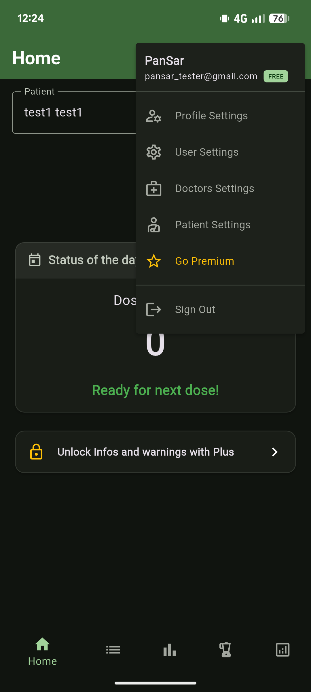
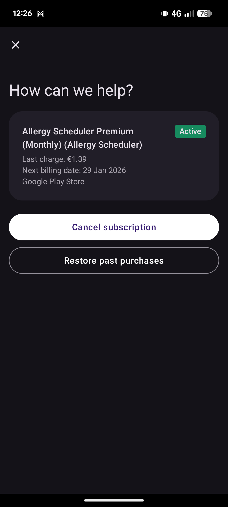

## 3. Managing Patients

The app allows you to manage one or more patients, each with their own treatment schedules and information.

### Creating a Patient

1.  From the main screen, tap on the **Add Patient** button.
2.  Fill in the patient's details, such as their name, date of birth, any known allergies, and their **Timezone**.
3.  Tap **Save** to create the patient profile.
- **Deleting a Patient**: Remove a patient profile from your account.

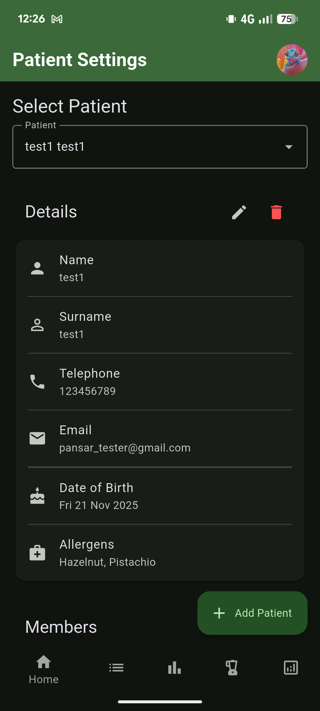

> **Note on Timezone**: The app uses the patient's timezone to correctly determine the end of the day for automatic "Day Off" dose creation and for generating accurate PDF reports.

### Switching Between Patients

- If you have multiple patients, you can switch between them using the patient selector at the top of the screen.

### Editing Patient Information

1.  Go to the **Patient Settings** tab.
2.  Here you can edit the patient's details, manage who has access to the patient's data, and other settings.

## 4. Tracking Doses

The **Doses** tab is where you can log and view individual medication doses.

- **Adding a dose:** Tap the **+** button to add a new dose. You'll be asked to enter the dosage amount, the time it was administered, and any relevant notes.
- **Viewing dose history:** The Doses screen displays a list of all past doses. You can filter this list by date, dosage amount, medical status, protocol, or use text search to find specific entries.
- **Editing or deleting a dose:** You can swipe left on a dose to edit or delete it.
- **Validations:** The app will warn you if you try to add a dose with a future date or if the time interval between doses is too short, but you can choose to proceed if necessary.
- **Special Statuses:**
  - **Day Off:** Marking a dose as a "Day Off" prevents adding any other doses for that day. It allows you to log a planned break in treatment.
  - **Seriously Ill:** Use this when the patient is too ill for the full protocol. Unlike "Day Off", you can still add other doses on the same day if the condition improves or changes. This status does not check for time intervals between doses.

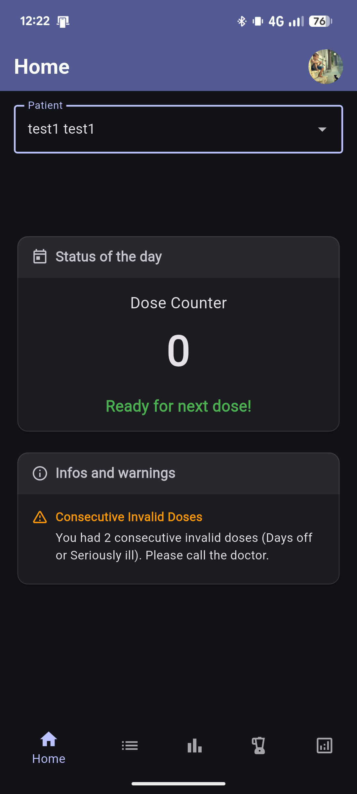
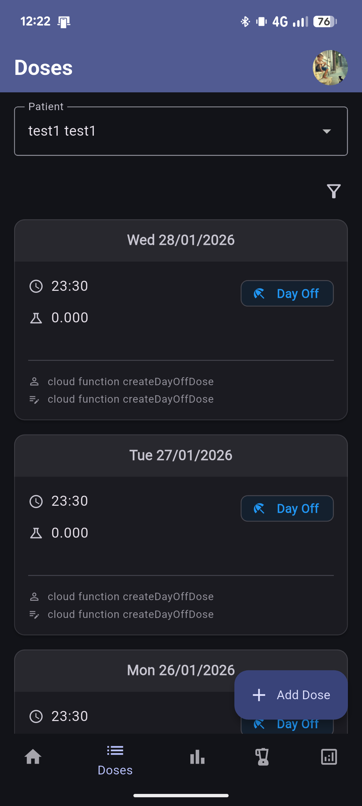
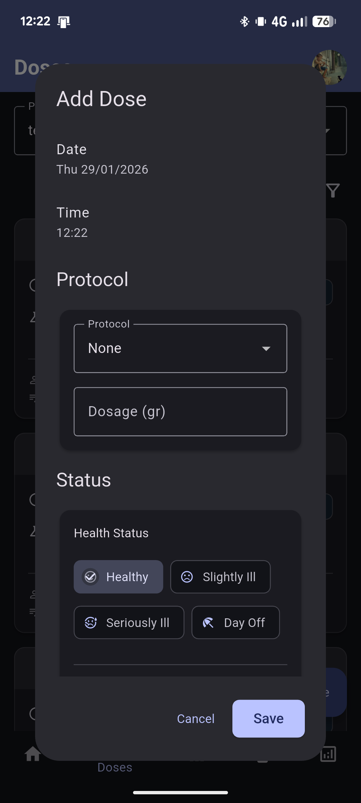

### Info and Warnings

The app automatically analyzes your dose history and may display warnings at the top of the Home screen if it detects issues, such as:

- Too many consecutive days with "Day Off" or "Seriously Ill" status.
- Days with insufficient doses (where you might need to repeat the day).
- Specific warnings based on health or medication status (e.g., Antibiotics use).

## 5. Dosage Summaries

The **Dosage Groups** tab provides a summary of all doses, grouped by dosage amount. This makes it easy to see how often each dosage has been administered.
 
 - **Exporting to PDF (Premium)**: You can generate a detailed report of your dosage history by tapping the **Export to PDF** button. This will open an **Elite PDF Viewer** (powered by pdfrx) where you can review the document with multi-touch zoom, navigate pages, and review all details. From there, you can choose to **save**, **share**, or **print** the report. This feature requires a **Premium** subscription.

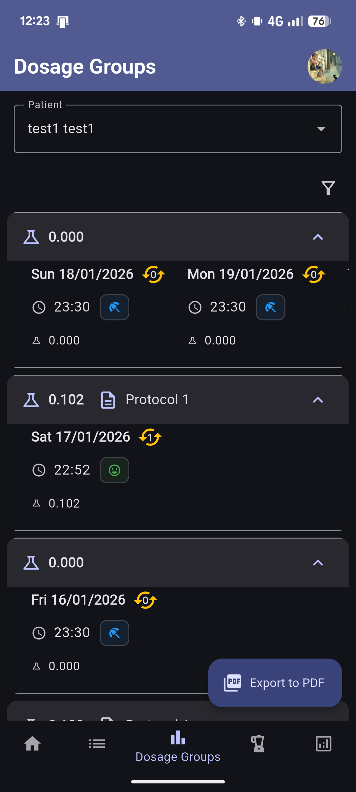
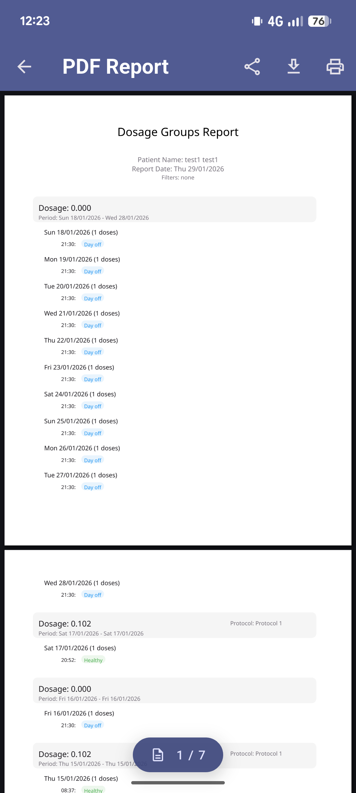

## 6. Usage Statistics

The **Usage Statistics** tab provides a detailed breakdown of your treatment history.

- **Overview:** View key metrics like Total Doses, Mean Doses per Day, and Highest Doses in a single day.
- **Patient Selection:** Easily switch between patients using the selector at the top.
- **Health Statuses:** Features a visual pie chart showing the distribution of all health statuses (Healthy, Slightly Ill, Seriously Ill, Day Off) across all doses, along with total counts for each status.
- **Detailed Breakdowns:** Separate cards show the total counts for each Medication Status and Reaction Status encountered during treatment.
- **Filtering:** You can filter the statistics to show data for all time, a specific year, or a specific month using the dropdown menus at the top of the page.
- **Monthly History:** A bar chart displaying the number of doses administered each month. If a year is selected, it shows the months of that year.

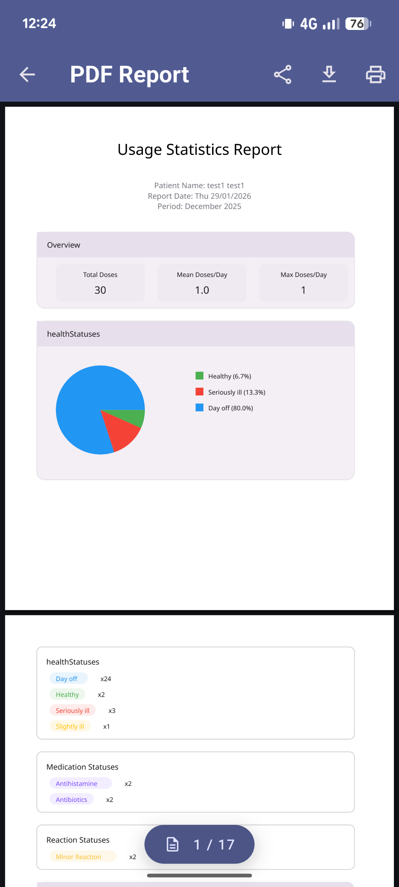

## 7. Managing Protocols

The **Protocols** tab allows you to set up and manage treatment protocols.

- **Creating a protocol:** You can create a new protocol by specifying a name, dosage, and frequency.
- **Managing Allergens**: Define specific allergens for each protocol.

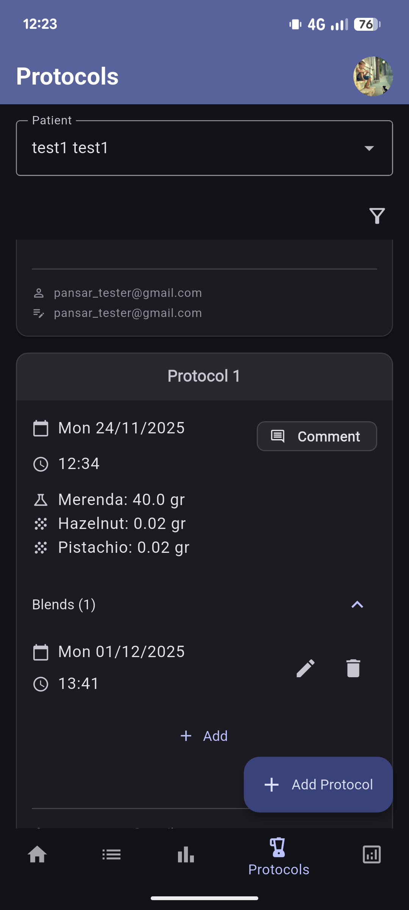
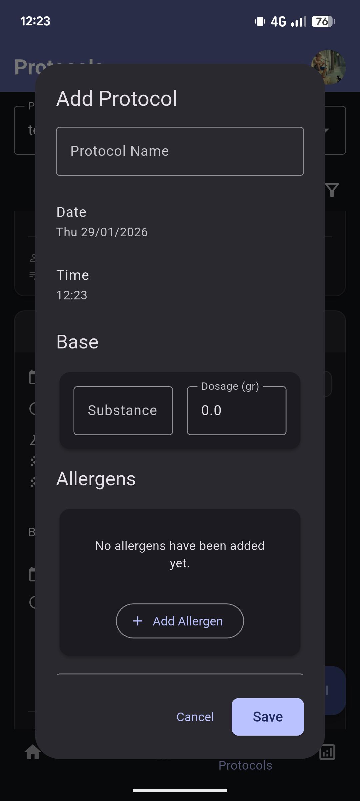
- **Viewing protocols:** The Protocols screen lists all your saved protocols, giving you a quick overview of your treatment plans.

## 8. Doctor Information

- **Doctor Settings:** In the **Doctor** tab, you can save and update your doctor's contact information for easy access.
- **Contact Information**: Save phone numbers (with quick dial), emails, and addresses.

## 9. App Settings

The **Settings** tab allows you to customize the app to your preferences.

- **Date & Time Format:** Choose how dates and times are displayed throughout the app.
- **Theme:** Switch between light and dark mode.
- **Theme Color:** Choose a custom seed color for the application theme.
- **Material Version:** Toggle between Material 2 and Material 3 design systems.
- **Language:** Change the app's display language.

> **Note:** Your settings for **Date & Time Format** and **Language** will also be used when generating PDF reports to ensure they are consistent with your preferences.

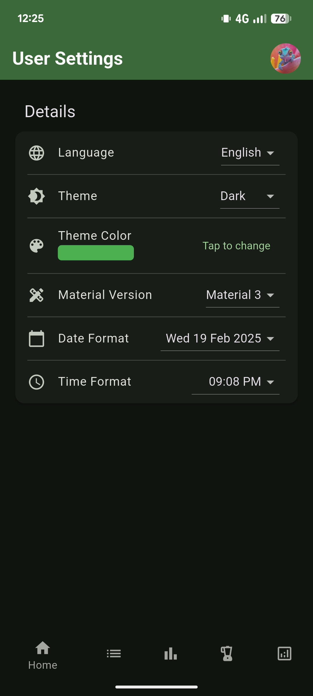

---

_This user manual was generated with the help of Gemini._
