# Allergy Scheduler User Manual

Welcome to Allergy Scheduler! This guide will help you get started and make the most of the app's features to manage your allergy treatment schedule.

## 1. Getting Started

### 1. Authentication

Securely access your data using your **Email & Password** or **Google Sign-In**.

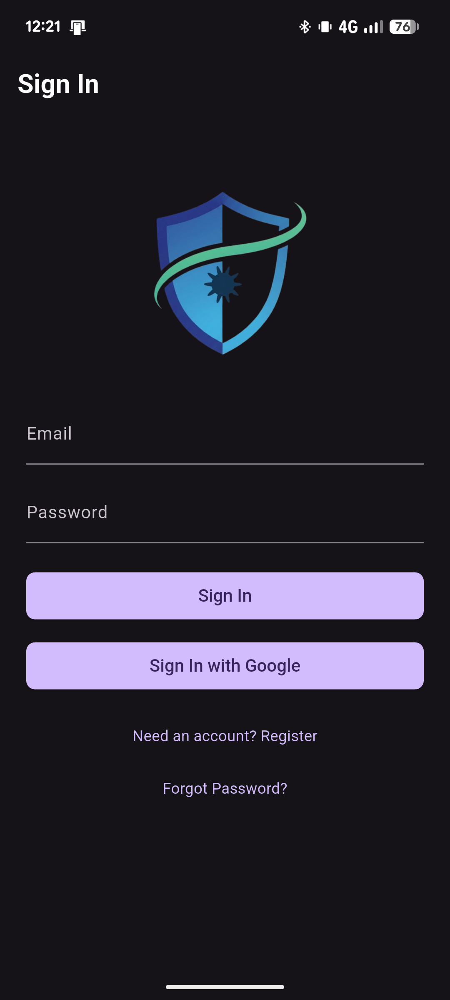

### 2. User Profile

Manage your account details and view your unique User ID.

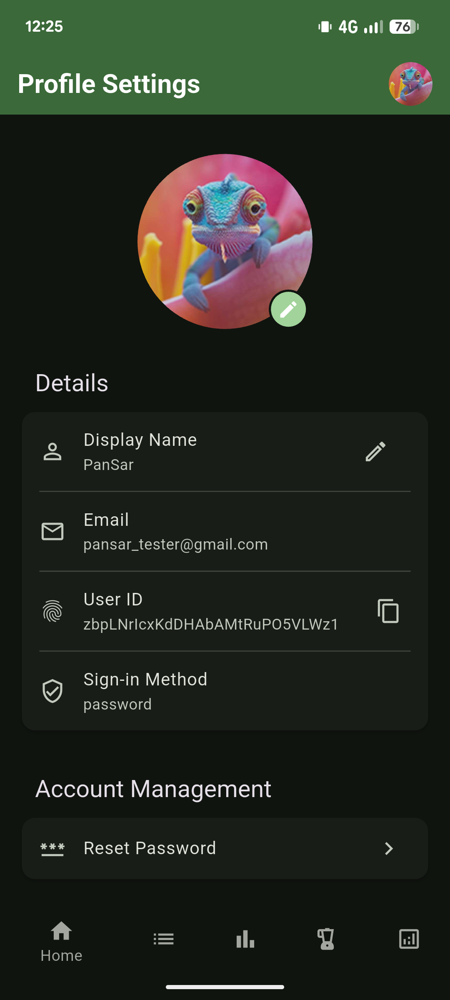

### Logging In

- **Log in:** Once you have an account, you can log in using the same method you used to sign up.

## 2. Subscription Plans

Allergy Scheduler offers three tiers to suit your needs. You can upgrade at any time through the Profile menu.

### 💎 Summary of Subscription Tiers

| Feature                    | Free      | Plus      | Premium |
| :------------------------- | :-------- | :-------- | :------ |
| **Basic Tracking**         | ✅ Open   | ✅ Open   | ✅ Open |
| **Info & Warnings**        | 🔒 Locked | ✅ Open   | ✅ Open |
| **Dosage Groups**          | 🔒 Locked | ✅ Open   | ✅ Open |
| **Usage Statistics**       | 🔒 Locked | 🔒 Locked | ✅ Open |
| **Settings Customization** | 🔒 Locked | 🔒 Locked | ✅ Open |
| **PDF Export**             | 🔒 Locked | 🔒 Locked | ✅ Open |

- **Premium**: Unlocks advanced features like **Unlimited Patients**, **PDF Export** for reports, and extended history.

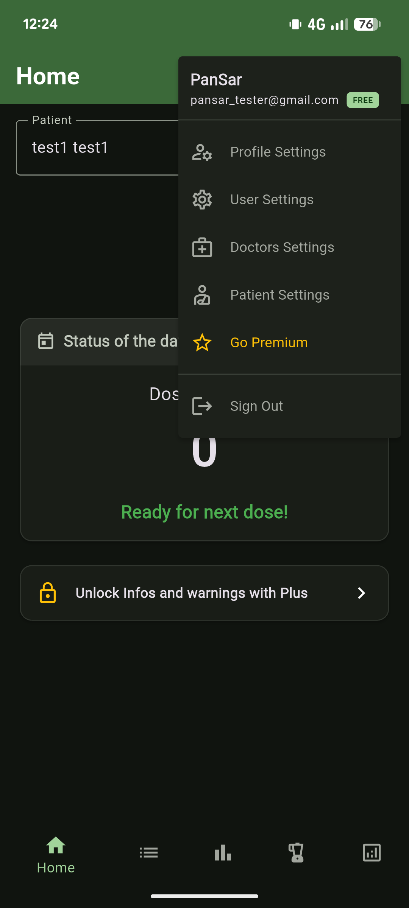 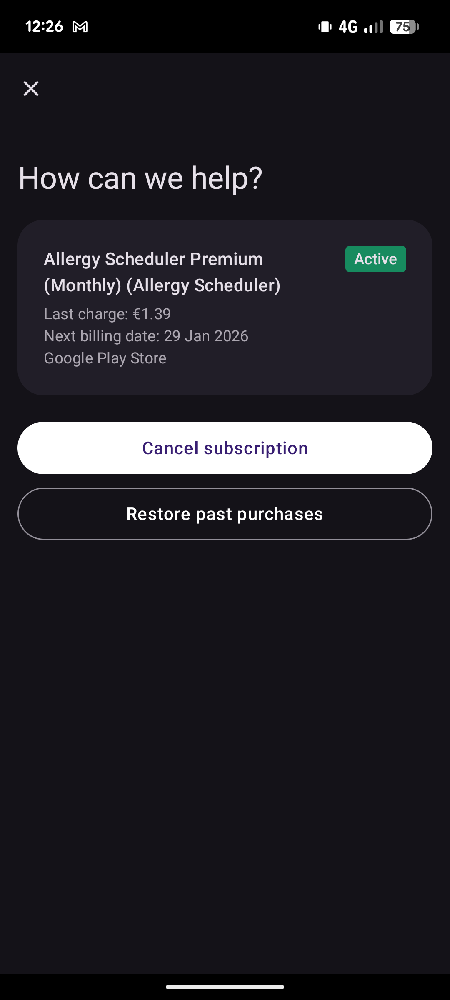

## 3. Managing Patients

The app allows you to manage one or more patients, each with their own treatment schedules and information.

### Creating or Joining a Patient

1.  From the main screen, tap on the **Add Patient** button.
2.  You can then choose between two options:
    - **Create New Patient**: Fill in the patient's details (name, date of birth, allergens, and **Timezone**) and tap **Save**.
    - **Request to Join a Patient**: Enter the 20-character **Patient ID** (shared with you by the admin) and your name. Tap **Join** to send a request.
3.  The patient admin will receive a notification and can accept or decline your request from their **Patient Settings**.

### Managing Members & Invitations

If you are a patient administrator, you can manage who else has access to the patient's data.

1.  Go to the **Patient Settings** tab.
2.  **Invite by Email**: Tap the **+** button in the "Members" section, enter the user's email address, and tap **Invite**. Note: The user must already be registered with this email. They will receive a notification to join.
3.  **Manage Requests**: Any pending "Join Requests" will appear at the top of the Patient Settings page. You can **Accept** or **Decline** them here.
4.  **Copy Patient ID**: To let someone request access, tap the **Copy** icon next to the Patient ID to copy it to your clipboard and send it to them.
5.  **Remove/Promote Members**: You can remove existing members or promote them to administrators.

- **Deleting a Patient**: Remove a patient profile from your account. This action is permanent and only available to administrators.

## 4. Tracking Doses

The **Doses** tab is where you can log and view individual medication doses.

- **Adding a dose:** Tap the **+** button to add a new dose. You'll be asked to enter the dosage amount, the time it was administered, and any relevant notes.
- **Viewing dose history:** The Doses screen displays a list of all past doses. You can filter this list by date, dosage amount, medical status, protocol, or use text search to find specific entries.
  - _Note on Filter Limitations:_ Due to core database design properties, you cannot combine "Text Search", "Date", and "Dosage" at the exact same time (applying one overrides the other, with Text Search taking highest priority). You also cannot select multiple specific specific medical statuses at the same time. This ensures search results are always lightning-fast.
- **Editing or deleting a dose:** You can swipe left on a dose to edit or delete it.
- **Validations:** The app will warn you if you try to add a dose with a future date or if the time interval between doses is too short, but you can choose to proceed if necessary.
- **Special Statuses:**
  - **Day Off:** Marking a dose as a "Day Off" prevents adding any other doses for that day. It allows you to log a planned break in treatment.
  - **Seriously Ill:** Use this when the patient is too ill for the full protocol. Unlike "Day Off", you can still add other doses on the same day if the condition improves or changes. This status does not check for time intervals between doses.

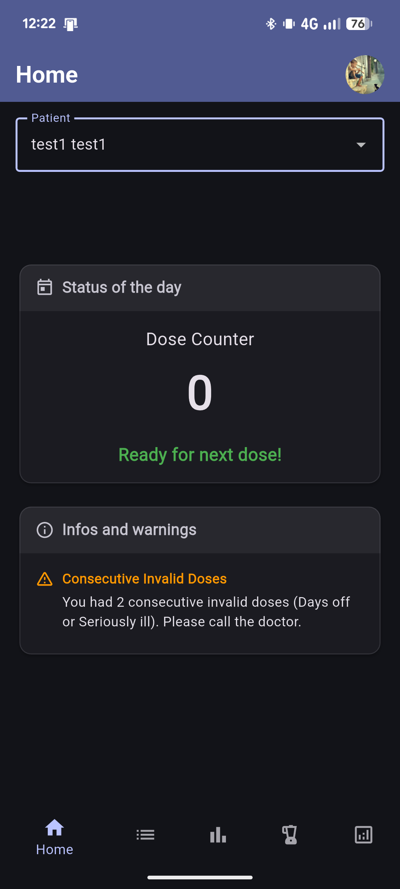 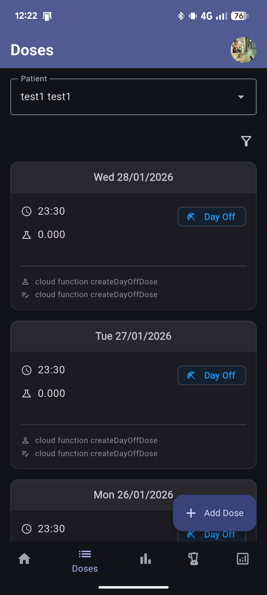 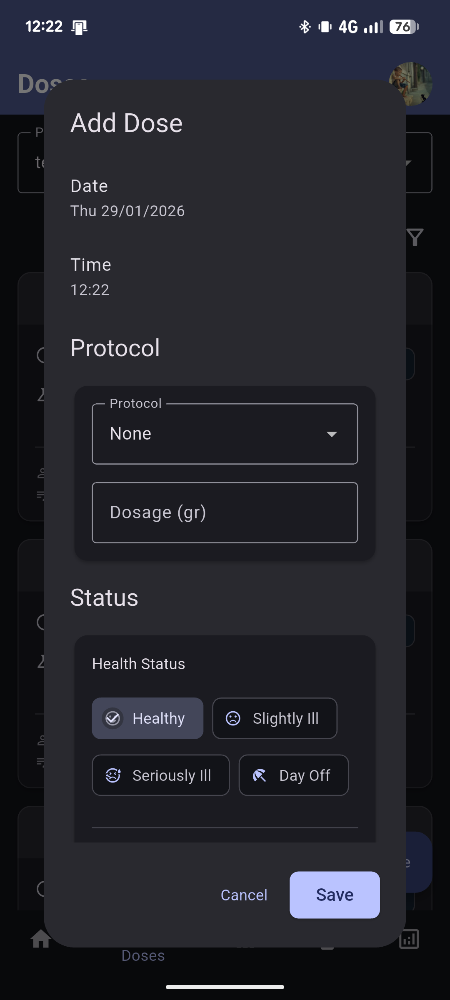

### Info and Warnings

The app automatically analyzes your dose history and may display warnings at the top of the Home screen if it detects issues, such as:

- Too many consecutive days with "Day Off" or "Seriously Ill" status.
- Days with insufficient doses (where you might need to repeat the day).
- Specific warnings based on health or medication status (e.g., Antibiotics use).

## 5. Dosage Summaries

The **Dosage Groups** tab provides a summary of all doses, grouped by dosage amount. This makes it easy to see how often each dosage has been administered.

- **Filtering**: Similar to individual doses, you can dynamically filter dosage groups by combining date ranges, dosage amounts, and mutually-exclusive specific statuses.
- **Exporting to PDF (Premium)**: You can generate a detailed report of your dosage history by tapping the **Export to PDF** button. This will open an **Elite PDF Viewer** (powered by pdfrx) where you can review the document with multi-touch zoom, navigate pages, and review all details. From there, you can choose to **save**, **share**, or **print** the report. This feature requires a **Premium** subscription.

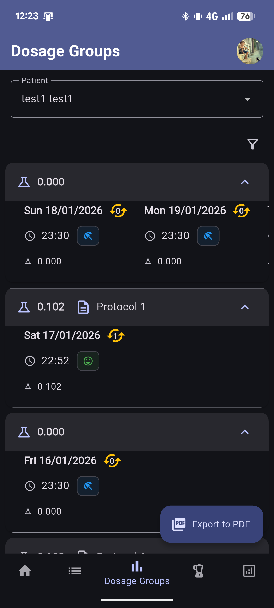 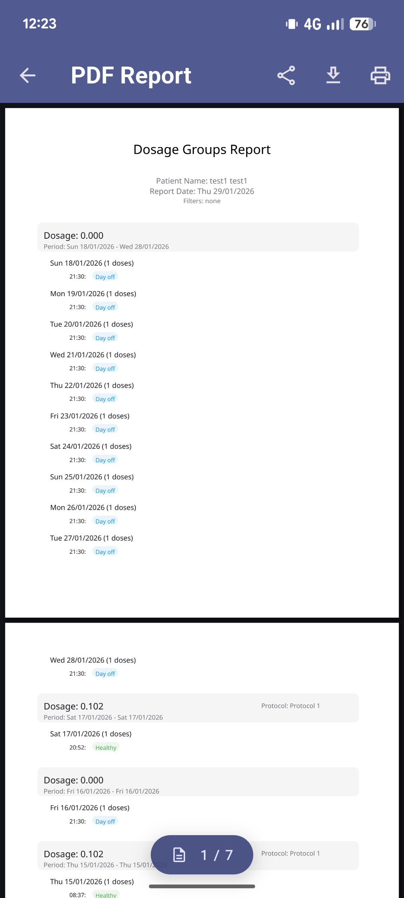

## 6. Usage Statistics

The **Usage Statistics** tab provides a detailed breakdown of your treatment history.

- **Overview:** View key metrics like Total Doses, Mean Doses per Day, and Highest Doses in a single day.
- **Patient Selection:** Easily switch between patients using the selector at the top.
- **Health Statuses:** Features a visual pie chart showing the distribution of all health statuses (Healthy, Slightly Ill, Seriously Ill, Day Off) across all doses, along with total counts for each status.
- **Detailed Breakdowns:** Separate cards show the total counts for each Medication Status and Reaction Status encountered during treatment.
- **Filtering:** You can filter the statistics to show data for all time, a specific year, or a specific month using the dropdown menus at the top of the page.
- **Monthly History:** A bar chart displaying the number of doses administered each month. If a year is selected, it shows the months of that year.

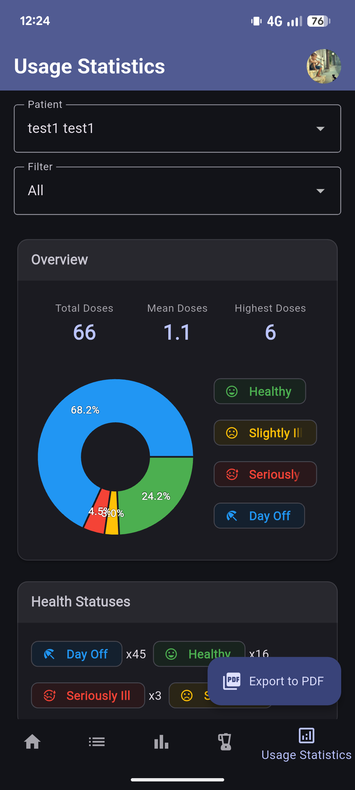 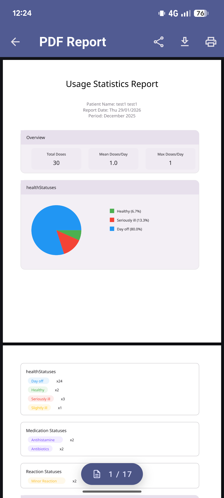

## 7. Managing Protocols

The **Protocols** tab allows you to set up and manage treatment protocols.

- **Creating a protocol:** You can create a new protocol by specifying a name, dosage, and frequency.
- **Managing Allergens**: Define specific allergens for each protocol.

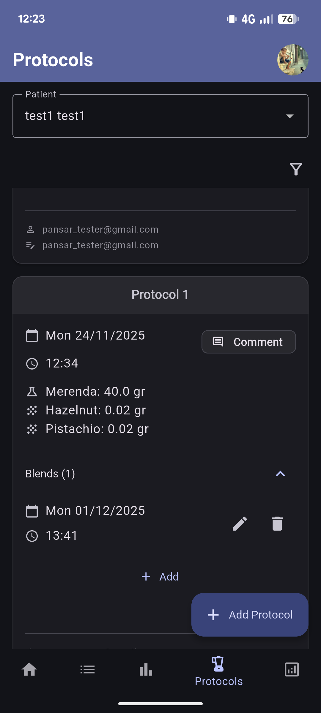 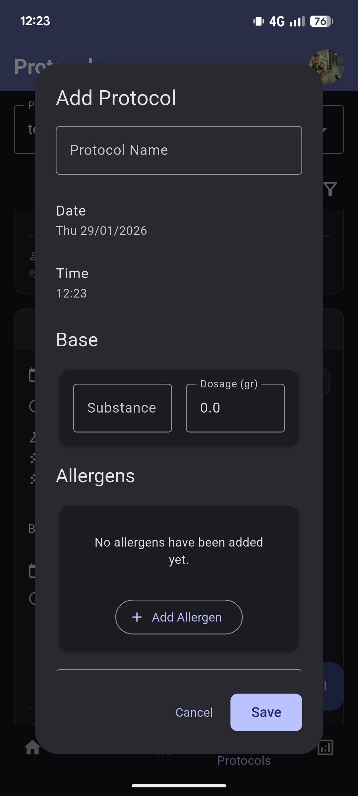

- **Viewing protocols:** The Protocols screen lists all your saved protocols, giving you a quick overview of your treatment plans.

## 8. Doctor Information

- **Doctor Settings:** In the **Doctor** tab, you can save and update your doctor's contact information for easy access.
- **Contact Information**: Save phone numbers (with quick dial), emails, and addresses.

## 9. App Settings

The **Settings** tab allows you to customize the app to your preferences.

- **Date & Time Format:** Choose how dates and times are displayed throughout the app.
- **Theme:** Switch between light and dark mode.
- **Theme Color:** Choose a custom seed color for the application theme.
- **Material Version:** Toggle between Material 2 and Material 3 design systems.
- **Language:** Change the app's display language.
- **Notification Devices:** Manage the devices currently registered to receive notifications. You can see your current device and remove old devices you no longer use.

> **Note:** Your settings for **Date & Time Format** and **Language** will also be used when generating PDF reports to ensure they are consistent with your preferences.

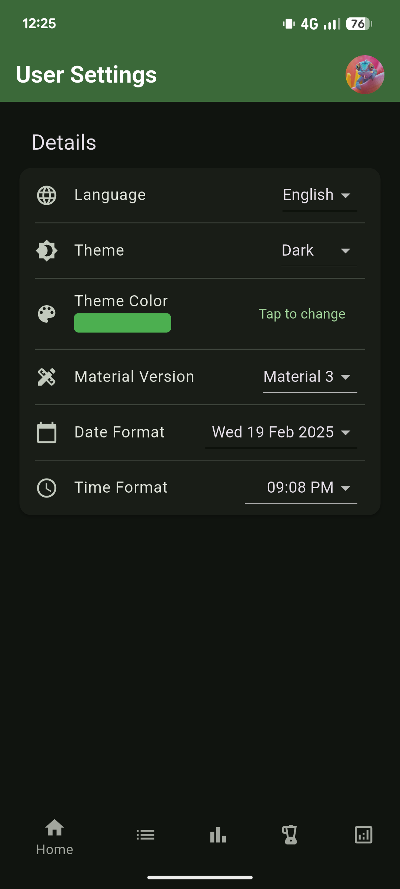

## 10. Troubleshooting

- **App refused to load due to Version Mismatch**: Allergy Scheduler enforces strict synchronization between the app version and the cloud server to prevent data corruption. If you see a screen asking you to "Update your app" or "Update backend", it means your app is out of date. Please visit the App Store / Google Play Store to download the latest version, or hard-refresh/clear your browser cache if you are using the Web version.

---

_This user manual was generated with the help of Gemini._
